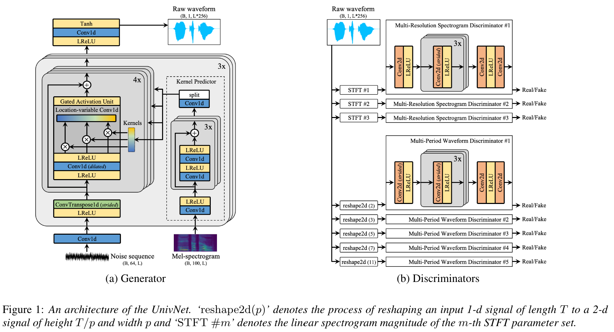
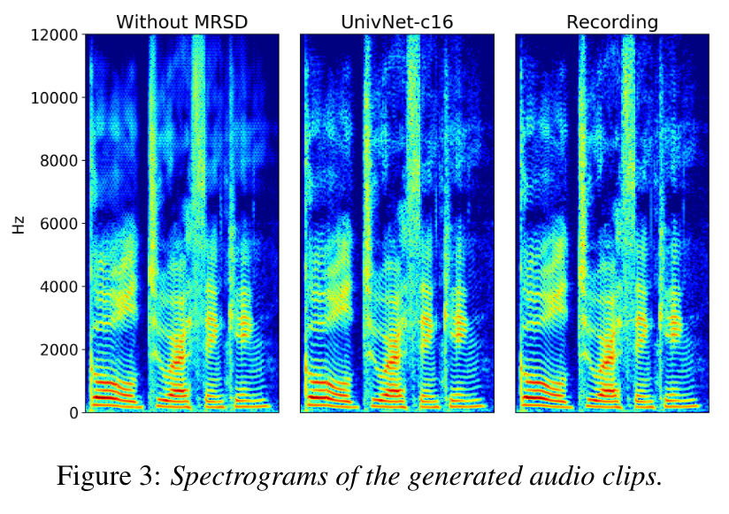

# Table of contents
{:.no_toc}
* toc
{:toc}

# Abstract

Most of neural vocoders use band-limited mel-spectrograms to generate waveforms. If full-band spectral features are used as input, the vocoder can be provided as much acoustic information as possible. However, in some models using full-band mel-spectrograms, an over-smoothing problem occurred in which non-sharp spectrograms were generated. To address the problem, We propose UnivNet, a neural vocoder that synthesizes high-fidelity waveform in real-time. Inspired by works in the field of voice activity detection, we added a multi-resolution spectrogram discriminator that uses multiple linear spectrogram magnitudes computed through various parameters. Under the condition of using full-band mel-spectrograms as input, we expect to be able to generate high resolution signals, by adding the discriminator that uses the spectrograms of multiple resolution as input. According to the evaluation on the dataset of hundreds of speakers, UnivNet obtained the best objective and subjective evaluation results among other GAN-based vocoders in both seen and unseen speakers. These results, including the best subjective score in fine-tuning scenario for text-to-speech, demonstrate the potential of fast adaptation to new speakers without training from scratch.

# Comparison with existing models
* All models in experiments were trained using four NVIDIA V100 GPUs.  
* We watched the training process of MelGAN and trained up to 2M steps to make stable sound quality, and the other models trained up to 1M steps.  

* [LibriTTS](https://openslr.org/60/) dataset is an English multi-speaker audiobook dataset.  
* ‘train-clean-360’ subset consisting of 192 hours, 116k utterances and 904 speakers was used to train the model and evaluate the speakers used for training (seen speakers).  
* ‘test-clean’ subset consisting of 9 hours, 5k utterances and 39 speakers was used to evaluate the speakers not used for training (unseen speakers).  

## Seen speakers ('LibriTTS/train-clean-360' dataset)
<table>
    <thead>
        <th>Models</th>
        <th>#1</th>
        <th>#2</th>
        <th>#3</th>
        <th>#4</th>
    </thead>
    <tbody>
        <tr>
            <th>Recordings</th>
            <td><audio controls style="width: 150px;"><source src="wav_for_demo/seen/ground_truth/tbd.wav" type="audio/wav"></audio></td>
            <td><audio controls style="width: 150px;"><source src="wav_for_demo/seen/ground_truth/tbd.wav" type="audio/wav"></audio></td>
            <td><audio controls style="width: 150px;"><source src="wav_for_demo/seen/ground_truth/tbd.wav" type="audio/wav"></audio></td>
            <td><audio controls style="width: 150px;"><source src="wav_for_demo/seen/ground_truth/tbd.wav" type="audio/wav"></audio></td>
        </tr>
    </tbody>
    <tbody>
        <tr>
            <th>MelGAN</th>
            <td><audio controls style="width: 150px;"><source src="wav_for_demo/seen/melgan/tbd.wav" type="audio/wav"></audio></td>
            <td><audio controls style="width: 150px;"><source src="wav_for_demo/seen/melgan/tbd.wav" type="audio/wav"></audio></td>
            <td><audio controls style="width: 150px;"><source src="wav_for_demo/seen/melgan/tbd.wav" type="audio/wav"></audio></td>
            <td><audio controls style="width: 150px;"><source src="wav_for_demo/seen/melgan/tbd.wav" type="audio/wav"></audio></td>
        </tr>
    </tbody>
    <tbody>
        <tr>
            <th>Parallel WaveGAN</th>
            <td><audio controls style="width: 150px;"><source src="wav_for_demo/seen/pwg/tbd.wav" type="audio/wav"></audio></td>
            <td><audio controls style="width: 150px;"><source src="wav_for_demo/seen/pwg/tbd.wav" type="audio/wav"></audio></td>
            <td><audio controls style="width: 150px;"><source src="wav_for_demo/seen/pwg/tbd.wav" type="audio/wav"></audio></td>
            <td><audio controls style="width: 150px;"><source src="wav_for_demo/seen/pwg/tbd.wav" type="audio/wav"></audio></td>
        </tr>
    </tbody>
    <tbody>
        <tr>
            <th>HiFi-GAN V1</th>
            <td><audio controls style="width: 150px;"><source src="wav_for_demo/seen/hifi-gan/tbd.wav" type="audio/wav"></audio></td>
            <td><audio controls style="width: 150px;"><source src="wav_for_demo/seen/hifi-gan/tbd.wav" type="audio/wav"></audio></td>
            <td><audio controls style="width: 150px;"><source src="wav_for_demo/seen/hifi-gan/tbd.wav" type="audio/wav"></audio></td>
            <td><audio controls style="width: 150px;"><source src="wav_for_demo/seen/hifi-gan/tbd.wav" type="audio/wav"></audio></td>
        </tr>
    </tbody>
        <tbody>
        <tr>
            <th>UnivNet-c16</th>
            <td><audio controls style="width: 150px;"><source src="wav_for_demo/seen/univnet-c16/tbd.wav" type="audio/wav"></audio></td>
            <td><audio controls style="width: 150px;"><source src="wav_for_demo/seen/univnet-c16/tbd.wav" type="audio/wav"></audio></td>
            <td><audio controls style="width: 150px;"><source src="wav_for_demo/seen/univnet-c16/tbd.wav" type="audio/wav"></audio></td>
            <td><audio controls style="width: 150px;"><source src="wav_for_demo/seen/univnet-c16/tbd.wav" type="audio/wav"></audio></td>
        </tr>
    </tbody>
        <tbody>
        <tr>
            <th>UnivNet-c32</th>
            <td><audio controls style="width: 150px;"><source src="wav_for_demo/seen/univnet-c32/tbd.wav" type="audio/wav"></audio></td>
            <td><audio controls style="width: 150px;"><source src="wav_for_demo/seen/univnet-c32/tbd.wav" type="audio/wav"></audio></td>
            <td><audio controls style="width: 150px;"><source src="wav_for_demo/seen/univnet-c32/tbd.wav" type="audio/wav"></audio></td>
            <td><audio controls style="width: 150px;"><source src="wav_for_demo/seen/univnet-c32/tbd.wav" type="audio/wav"></audio></td>
        </tr>
    </tbody>
</table>

## Unseen speakers ('LibriTTS/test-clean' dataset)
<table>
    <thead>
        <th>Models</th>
        <th>#1</th>
        <th>#2</th>
        <th>#3</th>
        <th>#4</th>
    </thead>
    <tbody>
        <tr>
            <th>Recordings</th>
            <td><audio controls style="width: 150px;"><source src="wav_for_demo/unseen/ground_truth/tbd.wav" type="audio/wav"></audio></td>
            <td><audio controls style="width: 150px;"><source src="wav_for_demo/unseen/ground_truth/tbd.wav" type="audio/wav"></audio></td>
            <td><audio controls style="width: 150px;"><source src="wav_for_demo/unseen/ground_truth/tbd.wav" type="audio/wav"></audio></td>
            <td><audio controls style="width: 150px;"><source src="wav_for_demo/unseen/ground_truth/tbd.wav" type="audio/wav"></audio></td>
        </tr>
    </tbody>
    <tbody>
        <tr>
            <th>MelGAN</th>
            <td><audio controls style="width: 150px;"><source src="wav_for_demo/unseen/melgan/tbd.wav" type="audio/wav"></audio></td>
            <td><audio controls style="width: 150px;"><source src="wav_for_demo/unseen/melgan/tbd.wav" type="audio/wav"></audio></td>
            <td><audio controls style="width: 150px;"><source src="wav_for_demo/unseen/melgan/tbd.wav" type="audio/wav"></audio></td>
            <td><audio controls style="width: 150px;"><source src="wav_for_demo/unseen/melgan/tbd.wav" type="audio/wav"></audio></td>
        </tr>
    </tbody>
    <tbody>
        <tr>
            <th>Parallel WaveGAN</th>
            <td><audio controls style="width: 150px;"><source src="wav_for_demo/unseen/pwg/tbd.wav" type="audio/wav"></audio></td>
            <td><audio controls style="width: 150px;"><source src="wav_for_demo/unseen/pwg/tbd.wav" type="audio/wav"></audio></td>
            <td><audio controls style="width: 150px;"><source src="wav_for_demo/unseen/pwg/tbd.wav" type="audio/wav"></audio></td>
            <td><audio controls style="width: 150px;"><source src="wav_for_demo/unseen/pwg/tbd.wav" type="audio/wav"></audio></td>
        </tr>
    </tbody>
    <tbody>
        <tr>
            <th>HiFi-GAN V1</th>
            <td><audio controls style="width: 150px;"><source src="wav_for_demo/unseen/hifi-gan/tbd.wav" type="audio/wav"></audio></td>
            <td><audio controls style="width: 150px;"><source src="wav_for_demo/unseen/hifi-gan/tbd.wav" type="audio/wav"></audio></td>
            <td><audio controls style="width: 150px;"><source src="wav_for_demo/unseen/hifi-gan/tbd.wav" type="audio/wav"></audio></td>
            <td><audio controls style="width: 150px;"><source src="wav_for_demo/unseen/hifi-gan/tbd.wav" type="audio/wav"></audio></td>
        </tr>
    </tbody>
        <tbody>
        <tr>
            <th>UnivNet-c16</th>
            <td><audio controls style="width: 150px;"><source src="wav_for_demo/unseen/univnet-c16/tbd.wav" type="audio/wav"></audio></td>
            <td><audio controls style="width: 150px;"><source src="wav_for_demo/unseen/univnet-c16/tbd.wav" type="audio/wav"></audio></td>
            <td><audio controls style="width: 150px;"><source src="wav_for_demo/unseen/univnet-c16/tbd.wav" type="audio/wav"></audio></td>
            <td><audio controls style="width: 150px;"><source src="wav_for_demo/unseen/univnet-c16/tbd.wav" type="audio/wav"></audio></td>
        </tr>
    </tbody>
        <tbody>
        <tr>
            <th>UnivNet-c32</th>
            <td><audio controls style="width: 150px;"><source src="wav_for_demo/unseen/univnet-c32/tbd.wav" type="audio/wav"></audio></td>
            <td><audio controls style="width: 150px;"><source src="wav_for_demo/unseen/univnet-c32/tbd.wav" type="audio/wav"></audio></td>
            <td><audio controls style="width: 150px;"><source src="wav_for_demo/unseen/univnet-c32/tbd.wav" type="audio/wav"></audio></td>
            <td><audio controls style="width: 150px;"><source src="wav_for_demo/unseen/univnet-c32/tbd.wav" type="audio/wav"></audio></td>
        </tr>
    </tbody>
</table>

## Text-to-speech ('LJSpeech' dataset)
* For text-to-speech evaluation, we used [JDI-T](https://arxiv.org/abs/2005.07799) acoustic model with a pitch and energy predictor.  
* Each trained vocoder was fine-tuned up to 100k steps using ground truth waveforms and predicted log-mel-spectrograms.  
* Note that we predicted the log-mel-spectrograms by using text, reference duration, ground truth pitch and energy.  
* [LJSpeech](https://keithito.com/LJ-Speech-Dataset/) dataset was used to train JDI-T and fine-tune each vocoder.  

<table>
    <thead>
        <th>Models</th>
        <th>#1</th>
        <th>#2</th>
        <th>#3</th>
        <th>#4</th>
    </thead>
    <tbody>
        <tr>
            <th>MelGAN</th>
            <td><audio controls style="width: 150px;"><source src="wav_for_demo/tts/melgan/tbd.wav" type="audio/wav"></audio></td>
            <td><audio controls style="width: 150px;"><source src="wav_for_demo/tts/melgan/tbd.wav" type="audio/wav"></audio></td>
            <td><audio controls style="width: 150px;"><source src="wav_for_demo/tts/melgan/tbd.wav" type="audio/wav"></audio></td>
            <td><audio controls style="width: 150px;"><source src="wav_for_demo/tts/melgan/tbd.wav" type="audio/wav"></audio></td>
        </tr>
    </tbody>
    <tbody>
        <tr>
            <th>Parallel WaveGAN</th>
            <td><audio controls style="width: 150px;"><source src="wav_for_demo/tts/pwg/tbd.wav" type="audio/wav"></audio></td>
            <td><audio controls style="width: 150px;"><source src="wav_for_demo/tts/pwg/tbd.wav" type="audio/wav"></audio></td>
            <td><audio controls style="width: 150px;"><source src="wav_for_demo/tts/pwg/tbd.wav" type="audio/wav"></audio></td>
            <td><audio controls style="width: 150px;"><source src="wav_for_demo/tts/pwg/tbd.wav" type="audio/wav"></audio></td>
        </tr>
    </tbody>
    <tbody>
        <tr>
            <th>HiFi-GAN V1</th>
            <td><audio controls style="width: 150px;"><source src="wav_for_demo/tts/hifi-gan/tbd.wav" type="audio/wav"></audio></td>
            <td><audio controls style="width: 150px;"><source src="wav_for_demo/tts/hifi-gan/tbd.wav" type="audio/wav"></audio></td>
            <td><audio controls style="width: 150px;"><source src="wav_for_demo/tts/hifi-gan/tbd.wav" type="audio/wav"></audio></td>
            <td><audio controls style="width: 150px;"><source src="wav_for_demo/tts/hifi-gan/tbd.wav" type="audio/wav"></audio></td>
        </tr>
    </tbody>
        <tbody>
        <tr>
            <th>UnivNet-c16</th>
            <td><audio controls style="width: 150px;"><source src="wav_for_demo/tts/univnet-c16/tbd.wav" type="audio/wav"></audio></td>
            <td><audio controls style="width: 150px;"><source src="wav_for_demo/tts/univnet-c16/tbd.wav" type="audio/wav"></audio></td>
            <td><audio controls style="width: 150px;"><source src="wav_for_demo/tts/univnet-c16/tbd.wav" type="audio/wav"></audio></td>
            <td><audio controls style="width: 150px;"><source src="wav_for_demo/tts/univnet-c16/tbd.wav" type="audio/wav"></audio></td>
        </tr>
    </tbody>
        <tbody>
        <tr>
            <th>UnivNet-c32</th>
            <td><audio controls style="width: 150px;"><source src="wav_for_demo/tts/univnet-c32/tbd.wav" type="audio/wav"></audio></td>
            <td><audio controls style="width: 150px;"><source src="wav_for_demo/tts/univnet-c32/tbd.wav" type="audio/wav"></audio></td>
            <td><audio controls style="width: 150px;"><source src="wav_for_demo/tts/univnet-c32/tbd.wav" type="audio/wav"></audio></td>
            <td><audio controls style="width: 150px;"><source src="wav_for_demo/tts/univnet-c32/tbd.wav" type="audio/wav"></audio></td>
        </tr>
    </tbody>
</table>

# Ablation study ('LibriTTS/train-clean-360' dataset)

<table>
    <thead>
        <th>Instances</th>
        <th>#1</th>
        <th>#2</th>
        <th>#3</th>
        <th>#4</th>
    </thead>
    <tbody>
        <tr>
            <th>Recordings</th>
            <td><audio controls style="width: 150px;"><source src="wav_for_demo/ablation/ground_truth/tbd.wav" type="audio/wav"></audio></td>
            <td><audio controls style="width: 150px;"><source src="wav_for_demo/ablation/ground_truth/tbd.wav" type="audio/wav"></audio></td>
            <td><audio controls style="width: 150px;"><source src="wav_for_demo/ablation/ground_truth/tbd.wav" type="audio/wav"></audio></td>
            <td><audio controls style="width: 150px;"><source src="wav_for_demo/ablation/ground_truth/tbd.wav" type="audio/wav"></audio></td>
        </tr>
    </tbody>
    <tbody>
        <tr>
            <th>UnivNet-c16</th>
            <td><audio controls style="width: 150px;"><source src="wav_for_demo/ablation/univnet-c16/tbd.wav" type="audio/wav"></audio></td>
            <td><audio controls style="width: 150px;"><source src="wav_for_demo/ablation/univnet-c16/tbd.wav" type="audio/wav"></audio></td>
            <td><audio controls style="width: 150px;"><source src="wav_for_demo/ablation/univnet-c16/tbd.wav" type="audio/wav"></audio></td>
            <td><audio controls style="width: 150px;"><source src="wav_for_demo/ablation/univnet-c16/tbd.wav" type="audio/wav"></audio></td>
        </tr>
    </tbody>
    <tbody>
        <tr>
            <th>Without LVC</th>
            <td><audio controls style="width: 150px;"><source src="wav_for_demo/ablation/wo_lvc/tbd.wav" type="audio/wav"></audio></td>
            <td><audio controls style="width: 150px;"><source src="wav_for_demo/ablation/wo_lvc/tbd.wav" type="audio/wav"></audio></td>
            <td><audio controls style="width: 150px;"><source src="wav_for_demo/ablation/wo_lvc/tbd.wav" type="audio/wav"></audio></td>
            <td><audio controls style="width: 150px;"><source src="wav_for_demo/ablation/wo_lvc/tbd.wav" type="audio/wav"></audio></td>
        </tr>
    </tbody>
    <tbody>
        <tr>
            <th>Without GAU</th>
            <td><audio controls style="width: 150px;"><source src="wav_for_demo/ablation/wo_gau/tbd.wav" type="audio/wav"></audio></td>
            <td><audio controls style="width: 150px;"><source src="wav_for_demo/ablation/wo_gau/tbd.wav" type="audio/wav"></audio></td>
            <td><audio controls style="width: 150px;"><source src="wav_for_demo/ablation/wo_gau/tbd.wav" type="audio/wav"></audio></td>
            <td><audio controls style="width: 150px;"><source src="wav_for_demo/ablation/wo_gau/tbd.wav" type="audio/wav"></audio></td>
        </tr>
    </tbody>
        <tbody>
        <tr>
            <th>Without MRSD</th>
            <td><audio controls style="width: 150px;"><source src="wav_for_demo/ablation/wo_mrsd/tbd.wav" type="audio/wav"></audio></td>
            <td><audio controls style="width: 150px;"><source src="wav_for_demo/ablation/wo_mrsd/tbd.wav" type="audio/wav"></audio></td>
            <td><audio controls style="width: 150px;"><source src="wav_for_demo/ablation/wo_mrsd/tbd.wav" type="audio/wav"></audio></td>
            <td><audio controls style="width: 150px;"><source src="wav_for_demo/ablation/wo_mrsd/tbd.wav" type="audio/wav"></audio></td>
        </tr>
    </tbody>
        <tbody>
        <tr>
            <th>Without MPWD</th>
            <td><audio controls style="width: 150px;"><source src="wav_for_demo/ablation/wo_mpwd/tbd.wav" type="audio/wav"></audio></td>
            <td><audio controls style="width: 150px;"><source src="wav_for_demo/ablation/wo_mpwd/tbd.wav" type="audio/wav"></audio></td>
            <td><audio controls style="width: 150px;"><source src="wav_for_demo/ablation/wo_mpwd/tbd.wav" type="audio/wav"></audio></td>
            <td><audio controls style="width: 150px;"><source src="wav_for_demo/ablation/wo_mpwd/tbd.wav" type="audio/wav"></audio></td>
        </tr>
    </tbody>
    <tbody>
        <tr>
            <th>With MSWD</th>
            <td><audio controls style="width: 150px;"><source src="wav_for_demo/ablation/w_mswd/tbd.wav" type="audio/wav"></audio></td>
            <td><audio controls style="width: 150px;"><source src="wav_for_demo/ablation/w_mswd/tbd.wav" type="audio/wav"></audio></td>
            <td><audio controls style="width: 150px;"><source src="wav_for_demo/ablation/w_mswd/tbd.wav" type="audio/wav"></audio></td>
            <td><audio controls style="width: 150px;"><source src="wav_for_demo/ablation/w_mswd/tbd.wav" type="audio/wav"></audio></td>
        </tr>
    </tbody>
    <tbody>
        <tr>
            <th>MPWD->MSWD</th>
            <td><audio controls style="width: 150px;"><source src="wav_for_demo/ablation/mpwd_to_mswd/tbd.wav" type="audio/wav"></audio></td>
            <td><audio controls style="width: 150px;"><source src="wav_for_demo/ablation/mpwd_to_mswd/tbd.wav" type="audio/wav"></audio></td>
            <td><audio controls style="width: 150px;"><source src="wav_for_demo/ablation/mpwd_to_mswd/tbd.wav" type="audio/wav"></audio></td>
            <td><audio controls style="width: 150px;"><source src="wav_for_demo/ablation/mpwd_to_mswd/tbd.wav" type="audio/wav"></audio></td>
        </tr>
    </tbody>
</table>
