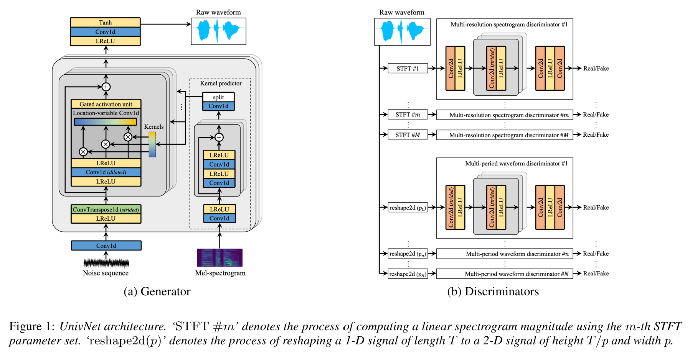

# Table of contents
{:.no_toc}
* toc
{:toc}

# Abstract

Most neural vocoders employ band-limited mel-spectrograms to generate waveforms. If full-band spectral features are used as the input, the vocoder can be provided with as much acoustic information as possible. However, in some models employing full-band mel-spectrograms, an over-smoothing problem occurs as part of which non-sharp spectrograms are generated. To address this problem, we propose UnivNet, a neural vocoder that synthesizes high-fidelity waveforms in real time. Inspired by works in the field of voice activity detection, we added a multi-resolution spectrogram discriminator that employs multiple linear spectrogram magnitudes computed using various parameter sets. Using full-band mel-spectrograms as input, we expect to generate high-resolution signals by adding a discriminator that employs spectrograms of multiple resolutions as the input. In an evaluation on a dataset containing information on hundreds of speakers, UnivNet obtained the best objective and subjective results among competing models for both seen and unseen speakers. These results, including the best subjective score for text-to-speech, demonstrate the potential for fast adaptation to new speakers without a need for training from scratch.

# Comparison with existing models
* The [LibriTTS](https://openslr.org/60/) dataset is an English multi-speaker audiobook dataset.  
* The ‘train-clean-360’ subset was used to train the model and evaluate the speakers used for training (seen speakers).  
* The ‘test-clean’ subset was used to evaluate the speakers not used for training (unseen speakers).  

## Seen speakers ('LibriTTS/train-clean-360' dataset)
<table width="100%">
    <thead>
        <th>Models</th>
        <th>#1</th>
        <th>#2</th>
        <th>#3</th>
        <th>#4</th>
        <th>#5</th>
    </thead>
    <tbody>
        <tr>
            <th>Recordings</th>
            <td><audio controls style="width: 150px;"><source src="wav_for_demo/seen/ground_truth/2004_147967_000029_000002.wav" type="audio/wav"></audio></td>
            <td><audio controls style="width: 150px;"><source src="wav_for_demo/seen/ground_truth/337_126286_000008_000000.wav" type="audio/wav"></audio></td>
            <td><audio controls style="width: 150px;"><source src="wav_for_demo/seen/ground_truth/3537_5704_000008_000005.wav" type="audio/wav"></audio></td>
            <td><audio controls style="width: 150px;"><source src="wav_for_demo/seen/ground_truth/5319_84357_000005_000004.wav" type="audio/wav"></audio></td>
            <td><audio controls style="width: 150px;"><source src="wav_for_demo/seen/ground_truth/6294_86679_000035_000004.wav" type="audio/wav"></audio></td>
        </tr>
    </tbody>
    <tbody>
        <tr>
            <th>MelGAN</th>
            <td><audio controls style="width: 150px;"><source src="wav_for_demo/seen/melgan/2004_147967_000029_000002.wav" type="audio/wav"></audio></td>
            <td><audio controls style="width: 150px;"><source src="wav_for_demo/seen/melgan/337_126286_000008_000000.wav" type="audio/wav"></audio></td>
            <td><audio controls style="width: 150px;"><source src="wav_for_demo/seen/melgan/3537_5704_000008_000005.wav" type="audio/wav"></audio></td>
            <td><audio controls style="width: 150px;"><source src="wav_for_demo/seen/melgan/5319_84357_000005_000004.wav" type="audio/wav"></audio></td>
            <td><audio controls style="width: 150px;"><source src="wav_for_demo/seen/melgan/6294_86679_000035_000004.wav" type="audio/wav"></audio></td>
        </tr>
    </tbody>
    <tbody>
        <tr>
            <th>Parallel WaveGAN</th>
            <td><audio controls style="width: 150px;"><source src="wav_for_demo/seen/pwg/2004_147967_000029_000002.wav" type="audio/wav"></audio></td>
            <td><audio controls style="width: 150px;"><source src="wav_for_demo/seen/pwg/337_126286_000008_000000.wav" type="audio/wav"></audio></td>
            <td><audio controls style="width: 150px;"><source src="wav_for_demo/seen/pwg/3537_5704_000008_000005.wav" type="audio/wav"></audio></td>
            <td><audio controls style="width: 150px;"><source src="wav_for_demo/seen/pwg/5319_84357_000005_000004.wav" type="audio/wav"></audio></td>
            <td><audio controls style="width: 150px;"><source src="wav_for_demo/seen/pwg/6294_86679_000035_000004.wav" type="audio/wav"></audio></td>
        </tr>
    </tbody>
    <tbody>
        <tr>
            <th>HiFi-GAN V1</th>
            <td><audio controls style="width: 150px;"><source src="wav_for_demo/seen/hifi-gan/2004_147967_000029_000002.wav" type="audio/wav"></audio></td>
            <td><audio controls style="width: 150px;"><source src="wav_for_demo/seen/hifi-gan/337_126286_000008_000000.wav" type="audio/wav"></audio></td>
            <td><audio controls style="width: 150px;"><source src="wav_for_demo/seen/hifi-gan/3537_5704_000008_000005.wav" type="audio/wav"></audio></td>
            <td><audio controls style="width: 150px;"><source src="wav_for_demo/seen/hifi-gan/5319_84357_000005_000004.wav" type="audio/wav"></audio></td>
            <td><audio controls style="width: 150px;"><source src="wav_for_demo/seen/hifi-gan/6294_86679_000035_000004.wav" type="audio/wav"></audio></td>
        </tr>
    </tbody>
        <tbody>
        <tr>
            <th>UnivNet-c16</th>
            <td><audio controls style="width: 150px;"><source src="wav_for_demo/seen/univnet-c16/2004_147967_000029_000002.wav" type="audio/wav"></audio></td>
            <td><audio controls style="width: 150px;"><source src="wav_for_demo/seen/univnet-c16/337_126286_000008_000000.wav" type="audio/wav"></audio></td>
            <td><audio controls style="width: 150px;"><source src="wav_for_demo/seen/univnet-c16/3537_5704_000008_000005.wav" type="audio/wav"></audio></td>
            <td><audio controls style="width: 150px;"><source src="wav_for_demo/seen/univnet-c16/5319_84357_000005_000004.wav" type="audio/wav"></audio></td>
            <td><audio controls style="width: 150px;"><source src="wav_for_demo/seen/univnet-c16/6294_86679_000035_000004.wav" type="audio/wav"></audio></td>
        </tr>
    </tbody>
        <tbody>
        <tr>
            <th>UnivNet-c32</th>
            <td><audio controls style="width: 150px;"><source src="wav_for_demo/seen/univnet-c32/2004_147967_000029_000002.wav" type="audio/wav"></audio></td>
            <td><audio controls style="width: 150px;"><source src="wav_for_demo/seen/univnet-c32/337_126286_000008_000000.wav" type="audio/wav"></audio></td>
            <td><audio controls style="width: 150px;"><source src="wav_for_demo/seen/univnet-c32/3537_5704_000008_000005.wav" type="audio/wav"></audio></td>
            <td><audio controls style="width: 150px;"><source src="wav_for_demo/seen/univnet-c32/5319_84357_000005_000004.wav" type="audio/wav"></audio></td>
            <td><audio controls style="width: 150px;"><source src="wav_for_demo/seen/univnet-c32/6294_86679_000035_000004.wav" type="audio/wav"></audio></td>
        </tr>
    </tbody>
</table>

## Unseen speakers ('LibriTTS/test-clean' dataset)
<table>
    <thead>
        <th>Models</th>
        <th>#1</th>
        <th>#2</th>
        <th>#3</th>
        <th>#4</th>
        <th>#5</th>
    </thead>
    <tbody>
        <tr>
            <th>Recordings</th>
            <td><audio controls style="width: 150px;"><source src="wav_for_demo/unseen/ground_truth/1089_134686_000007_000005.wav" type="audio/wav"></audio></td>
            <td><audio controls style="width: 150px;"><source src="wav_for_demo/unseen/ground_truth/3575_170457_000037_000002.wav" type="audio/wav"></audio></td>
            <td><audio controls style="width: 150px;"><source src="wav_for_demo/unseen/ground_truth/7021_85628_000037_000000.wav" type="audio/wav"></audio></td>
            <td><audio controls style="width: 150px;"><source src="wav_for_demo/unseen/ground_truth/7176_92135_000006_000005.wav" type="audio/wav"></audio></td>
            <td><audio controls style="width: 150px;"><source src="wav_for_demo/unseen/ground_truth/8224_274384_000016_000000.wav" type="audio/wav"></audio></td>
        </tr>
    </tbody>
    <tbody>
        <tr>
            <th>MelGAN</th>
            <td><audio controls style="width: 150px;"><source src="wav_for_demo/unseen/melgan/1089_134686_000007_000005.wav" type="audio/wav"></audio></td>
            <td><audio controls style="width: 150px;"><source src="wav_for_demo/unseen/melgan/3575_170457_000037_000002.wav" type="audio/wav"></audio></td>
            <td><audio controls style="width: 150px;"><source src="wav_for_demo/unseen/melgan/7021_85628_000037_000000.wav" type="audio/wav"></audio></td>
            <td><audio controls style="width: 150px;"><source src="wav_for_demo/unseen/melgan/7176_92135_000006_000005.wav" type="audio/wav"></audio></td>
            <td><audio controls style="width: 150px;"><source src="wav_for_demo/unseen/melgan/8224_274384_000016_000000.wav" type="audio/wav"></audio></td>
        </tr>
    </tbody>
    <tbody>
        <tr>
            <th>Parallel WaveGAN</th>
            <td><audio controls style="width: 150px;"><source src="wav_for_demo/unseen/pwg/1089_134686_000007_000005.wav" type="audio/wav"></audio></td>
            <td><audio controls style="width: 150px;"><source src="wav_for_demo/unseen/pwg/3575_170457_000037_000002.wav" type="audio/wav"></audio></td>
            <td><audio controls style="width: 150px;"><source src="wav_for_demo/unseen/pwg/7021_85628_000037_000000.wav" type="audio/wav"></audio></td>
            <td><audio controls style="width: 150px;"><source src="wav_for_demo/unseen/pwg/7176_92135_000006_000005.wav" type="audio/wav"></audio></td>
            <td><audio controls style="width: 150px;"><source src="wav_for_demo/unseen/pwg/8224_274384_000016_000000.wav" type="audio/wav"></audio></td>
        </tr>
    </tbody>
    <tbody>
        <tr>
            <th>HiFi-GAN V1</th>
            <td><audio controls style="width: 150px;"><source src="wav_for_demo/unseen/hifi-gan/1089_134686_000007_000005.wav" type="audio/wav"></audio></td>
            <td><audio controls style="width: 150px;"><source src="wav_for_demo/unseen/hifi-gan/3575_170457_000037_000002.wav" type="audio/wav"></audio></td>
            <td><audio controls style="width: 150px;"><source src="wav_for_demo/unseen/hifi-gan/7021_85628_000037_000000.wav" type="audio/wav"></audio></td>
            <td><audio controls style="width: 150px;"><source src="wav_for_demo/unseen/hifi-gan/7176_92135_000006_000005.wav" type="audio/wav"></audio></td>
            <td><audio controls style="width: 150px;"><source src="wav_for_demo/unseen/hifi-gan/8224_274384_000016_000000.wav" type="audio/wav"></audio></td>
        </tr>
    </tbody>
        <tbody>
        <tr>
            <th>UnivNet-c16</th>
            <td><audio controls style="width: 150px;"><source src="wav_for_demo/unseen/univnet-c16/1089_134686_000007_000005.wav" type="audio/wav"></audio></td>
            <td><audio controls style="width: 150px;"><source src="wav_for_demo/unseen/univnet-c16/3575_170457_000037_000002.wav" type="audio/wav"></audio></td>
            <td><audio controls style="width: 150px;"><source src="wav_for_demo/unseen/univnet-c16/7021_85628_000037_000000.wav" type="audio/wav"></audio></td>
            <td><audio controls style="width: 150px;"><source src="wav_for_demo/unseen/univnet-c16/7176_92135_000006_000005.wav" type="audio/wav"></audio></td>
            <td><audio controls style="width: 150px;"><source src="wav_for_demo/unseen/univnet-c16/8224_274384_000016_000000.wav" type="audio/wav"></audio></td>
        </tr>
    </tbody>
        <tbody>
        <tr>
            <th>UnivNet-c32</th>
            <td><audio controls style="width: 150px;"><source src="wav_for_demo/unseen/univnet-c32/1089_134686_000007_000005.wav" type="audio/wav"></audio></td>
            <td><audio controls style="width: 150px;"><source src="wav_for_demo/unseen/univnet-c32/3575_170457_000037_000002.wav" type="audio/wav"></audio></td>
            <td><audio controls style="width: 150px;"><source src="wav_for_demo/unseen/univnet-c32/7021_85628_000037_000000.wav" type="audio/wav"></audio></td>
            <td><audio controls style="width: 150px;"><source src="wav_for_demo/unseen/univnet-c32/7176_92135_000006_000005.wav" type="audio/wav"></audio></td>
            <td><audio controls style="width: 150px;"><source src="wav_for_demo/unseen/univnet-c32/8224_274384_000016_000000.wav" type="audio/wav"></audio></td>
        </tr>
    </tbody>
</table>

## Text-to-speech ('LJSpeech' dataset)
* For text-to-speech evaluation, we used [JDI-T](https://arxiv.org/abs/2005.07799) acoustic model with a pitch and energy predictor.  
* We converted text to phoneme sequences using [open-sourced software](https://github.com/bootphon/phonemizer).  
* Each trained vocoder was fine-tuned using ground truth waveforms and predicted log-mel-spectrograms.  
* The [LJSpeech](https://keithito.com/LJ-Speech-Dataset/) dataset was used to train JDI-T and fine-tune each vocoder.  

<table>
    <thead>
        <th>Models</th>
        <th>#1</th>
        <th>#2</th>
        <th>#3</th>
        <th>#4</th>
        <th>#5</th>
    </thead>
    <tbody>
        <tr>
            <th>MelGAN</th>
            <td><audio controls style="width: 150px;"><source src="wav_for_demo/tts/melgan/15.wav" type="audio/wav"></audio></td>
            <td><audio controls style="width: 150px;"><source src="wav_for_demo/tts/melgan/16.wav" type="audio/wav"></audio></td>
            <td><audio controls style="width: 150px;"><source src="wav_for_demo/tts/melgan/17.wav" type="audio/wav"></audio></td>
            <td><audio controls style="width: 150px;"><source src="wav_for_demo/tts/melgan/29.wav" type="audio/wav"></audio></td>
            <td><audio controls style="width: 150px;"><source src="wav_for_demo/tts/melgan/102.wav" type="audio/wav"></audio></td>
        </tr>
    </tbody>
    <tbody>
        <tr>
            <th>Parallel WaveGAN</th>
            <td><audio controls style="width: 150px;"><source src="wav_for_demo/tts/pwg/15.wav" type="audio/wav"></audio></td>
            <td><audio controls style="width: 150px;"><source src="wav_for_demo/tts/pwg/16.wav" type="audio/wav"></audio></td>
            <td><audio controls style="width: 150px;"><source src="wav_for_demo/tts/pwg/17.wav" type="audio/wav"></audio></td>
            <td><audio controls style="width: 150px;"><source src="wav_for_demo/tts/pwg/29.wav" type="audio/wav"></audio></td>
            <td><audio controls style="width: 150px;"><source src="wav_for_demo/tts/pwg/102.wav" type="audio/wav"></audio></td>
        </tr>
    </tbody>
    <tbody>
        <tr>
            <th>HiFi-GAN V1</th>
            <td><audio controls style="width: 150px;"><source src="wav_for_demo/tts/hifi-gan/15.wav" type="audio/wav"></audio></td>
            <td><audio controls style="width: 150px;"><source src="wav_for_demo/tts/hifi-gan/16.wav" type="audio/wav"></audio></td>
            <td><audio controls style="width: 150px;"><source src="wav_for_demo/tts/hifi-gan/17.wav" type="audio/wav"></audio></td>
            <td><audio controls style="width: 150px;"><source src="wav_for_demo/tts/hifi-gan/29.wav" type="audio/wav"></audio></td>
            <td><audio controls style="width: 150px;"><source src="wav_for_demo/tts/hifi-gan/102.wav" type="audio/wav"></audio></td>
        </tr>
    </tbody>
        <tbody>
        <tr>
            <th>UnivNet-c16</th>
            <td><audio controls style="width: 150px;"><source src="wav_for_demo/tts/univnet-c16/15.wav" type="audio/wav"></audio></td>
            <td><audio controls style="width: 150px;"><source src="wav_for_demo/tts/univnet-c16/16.wav" type="audio/wav"></audio></td>
            <td><audio controls style="width: 150px;"><source src="wav_for_demo/tts/univnet-c16/17.wav" type="audio/wav"></audio></td>
            <td><audio controls style="width: 150px;"><source src="wav_for_demo/tts/univnet-c16/29.wav" type="audio/wav"></audio></td>
            <td><audio controls style="width: 150px;"><source src="wav_for_demo/tts/univnet-c16/102.wav" type="audio/wav"></audio></td>
        </tr>
    </tbody>
        <tbody>
        <tr>
            <th>UnivNet-c32</th>
            <td><audio controls style="width: 150px;"><source src="wav_for_demo/tts/univnet-c32/15.wav" type="audio/wav"></audio></td>
            <td><audio controls style="width: 150px;"><source src="wav_for_demo/tts/univnet-c32/16.wav" type="audio/wav"></audio></td>
            <td><audio controls style="width: 150px;"><source src="wav_for_demo/tts/univnet-c32/17.wav" type="audio/wav"></audio></td>
            <td><audio controls style="width: 150px;"><source src="wav_for_demo/tts/univnet-c32/29.wav" type="audio/wav"></audio></td>
            <td><audio controls style="width: 150px;"><source src="wav_for_demo/tts/univnet-c32/102.wav" type="audio/wav"></audio></td>
        </tr>
    </tbody>
</table>

# Ablation study
* To demonstrate the validity of the proposed model configuration, we prepared instances in which each component (i.e. LVC, GAU, MRSD and MPWD) of the model was removed.  
* We also evaluated with some combinations of discriminators including [multi-scale waveform discriminator (MSWD)](https://arxiv.org/abs/1910.06711).  
* UnivNet-c16, a lightweight version of the model, was used for comparison.  

## Seen speakers ('LibriTTS/train-clean-360' dataset)

<table>
    <thead>
        <th>Instances</th>
        <th>#1</th>
        <th>#2</th>
        <th>#3</th>
        <th>#4</th>
        <th>#5</th>
    </thead>
    <tbody>
        <tr>
            <th>Recordings</th>
            <td><audio controls style="width: 150px;"><source src="wav_for_demo/ablation/ground_truth/2004_147967_000029_000002.wav" type="audio/wav"></audio></td>
            <td><audio controls style="width: 150px;"><source src="wav_for_demo/ablation/ground_truth/337_126286_000008_000000.wav" type="audio/wav"></audio></td>
            <td><audio controls style="width: 150px;"><source src="wav_for_demo/ablation/ground_truth/3537_5704_000008_000005.wav" type="audio/wav"></audio></td>
            <td><audio controls style="width: 150px;"><source src="wav_for_demo/ablation/ground_truth/5319_84357_000005_000004.wav" type="audio/wav"></audio></td>
            <td><audio controls style="width: 150px;"><source src="wav_for_demo/ablation/ground_truth/6294_86679_000035_000004.wav" type="audio/wav"></audio></td>
        </tr>
    </tbody>
    <tbody>
        <tr>
            <th>UnivNet-c16</th>
            <td><audio controls style="width: 150px;"><source src="wav_for_demo/ablation/univnet-c16/2004_147967_000029_000002.wav" type="audio/wav"></audio></td>
            <td><audio controls style="width: 150px;"><source src="wav_for_demo/ablation/univnet-c16/337_126286_000008_000000.wav" type="audio/wav"></audio></td>
            <td><audio controls style="width: 150px;"><source src="wav_for_demo/ablation/univnet-c16/3537_5704_000008_000005.wav" type="audio/wav"></audio></td>
            <td><audio controls style="width: 150px;"><source src="wav_for_demo/ablation/univnet-c16/5319_84357_000005_000004.wav" type="audio/wav"></audio></td>
            <td><audio controls style="width: 150px;"><source src="wav_for_demo/ablation/univnet-c16/6294_86679_000035_000004.wav" type="audio/wav"></audio></td>
        </tr>
    </tbody>
    <tbody>
        <tr>
            <th>Without LVC</th>
            <td><audio controls style="width: 150px;"><source src="wav_for_demo/ablation/wo_lvc/2004_147967_000029_000002.wav" type="audio/wav"></audio></td>
            <td><audio controls style="width: 150px;"><source src="wav_for_demo/ablation/wo_lvc/337_126286_000008_000000.wav" type="audio/wav"></audio></td>
            <td><audio controls style="width: 150px;"><source src="wav_for_demo/ablation/wo_lvc/3537_5704_000008_000005.wav" type="audio/wav"></audio></td>
            <td><audio controls style="width: 150px;"><source src="wav_for_demo/ablation/wo_lvc/5319_84357_000005_000004.wav" type="audio/wav"></audio></td>
            <td><audio controls style="width: 150px;"><source src="wav_for_demo/ablation/wo_lvc/6294_86679_000035_000004.wav" type="audio/wav"></audio></td>
        </tr>
    </tbody>
    <tbody>
        <tr>
            <th>Without GAU</th>
            <td><audio controls style="width: 150px;"><source src="wav_for_demo/ablation/wo_gau/2004_147967_000029_000002.wav" type="audio/wav"></audio></td>
            <td><audio controls style="width: 150px;"><source src="wav_for_demo/ablation/wo_gau/337_126286_000008_000000.wav" type="audio/wav"></audio></td>
            <td><audio controls style="width: 150px;"><source src="wav_for_demo/ablation/wo_gau/3537_5704_000008_000005.wav" type="audio/wav"></audio></td>
            <td><audio controls style="width: 150px;"><source src="wav_for_demo/ablation/wo_gau/5319_84357_000005_000004.wav" type="audio/wav"></audio></td>
            <td><audio controls style="width: 150px;"><source src="wav_for_demo/ablation/wo_gau/6294_86679_000035_000004.wav" type="audio/wav"></audio></td>
        </tr>
    </tbody>
        <tbody>
        <tr>
            <th>Without MRSD</th>
            <td><audio controls style="width: 150px;"><source src="wav_for_demo/ablation/wo_mrsd/2004_147967_000029_000002.wav" type="audio/wav"></audio></td>
            <td><audio controls style="width: 150px;"><source src="wav_for_demo/ablation/wo_mrsd/337_126286_000008_000000.wav" type="audio/wav"></audio></td>
            <td><audio controls style="width: 150px;"><source src="wav_for_demo/ablation/wo_mrsd/3537_5704_000008_000005.wav" type="audio/wav"></audio></td>
            <td><audio controls style="width: 150px;"><source src="wav_for_demo/ablation/wo_mrsd/5319_84357_000005_000004.wav" type="audio/wav"></audio></td>
            <td><audio controls style="width: 150px;"><source src="wav_for_demo/ablation/wo_mrsd/6294_86679_000035_000004.wav" type="audio/wav"></audio></td>
        </tr>
    </tbody>
        <tbody>
        <tr>
            <th>Without MPWD</th>
            <td><audio controls style="width: 150px;"><source src="wav_for_demo/ablation/wo_mpwd/2004_147967_000029_000002.wav" type="audio/wav"></audio></td>
            <td><audio controls style="width: 150px;"><source src="wav_for_demo/ablation/wo_mpwd/337_126286_000008_000000.wav" type="audio/wav"></audio></td>
            <td><audio controls style="width: 150px;"><source src="wav_for_demo/ablation/wo_mpwd/3537_5704_000008_000005.wav" type="audio/wav"></audio></td>
            <td><audio controls style="width: 150px;"><source src="wav_for_demo/ablation/wo_mpwd/5319_84357_000005_000004.wav" type="audio/wav"></audio></td>
            <td><audio controls style="width: 150px;"><source src="wav_for_demo/ablation/wo_mpwd/6294_86679_000035_000004.wav" type="audio/wav"></audio></td>
        </tr>
    </tbody>
    <tbody>
        <tr>
            <th>With MSWD</th>
            <td><audio controls style="width: 150px;"><source src="wav_for_demo/ablation/w_mswd/2004_147967_000029_000002.wav" type="audio/wav"></audio></td>
            <td><audio controls style="width: 150px;"><source src="wav_for_demo/ablation/w_mswd/337_126286_000008_000000.wav" type="audio/wav"></audio></td>
            <td><audio controls style="width: 150px;"><source src="wav_for_demo/ablation/w_mswd/3537_5704_000008_000005.wav" type="audio/wav"></audio></td>
            <td><audio controls style="width: 150px;"><source src="wav_for_demo/ablation/w_mswd/5319_84357_000005_000004.wav" type="audio/wav"></audio></td>
            <td><audio controls style="width: 150px;"><source src="wav_for_demo/ablation/w_mswd/6294_86679_000035_000004.wav" type="audio/wav"></audio></td>
        </tr>
    </tbody>
    <tbody>
        <tr>
            <th>MPWD->MSWD</th>
            <td><audio controls style="width: 150px;"><source src="wav_for_demo/ablation/mpwd_to_mswd/2004_147967_000029_000002.wav" type="audio/wav"></audio></td>
            <td><audio controls style="width: 150px;"><source src="wav_for_demo/ablation/mpwd_to_mswd/337_126286_000008_000000.wav" type="audio/wav"></audio></td>
            <td><audio controls style="width: 150px;"><source src="wav_for_demo/ablation/mpwd_to_mswd/3537_5704_000008_000005.wav" type="audio/wav"></audio></td>
            <td><audio controls style="width: 150px;"><source src="wav_for_demo/ablation/mpwd_to_mswd/5319_84357_000005_000004.wav" type="audio/wav"></audio></td>
            <td><audio controls style="width: 150px;"><source src="wav_for_demo/ablation/mpwd_to_mswd/6294_86679_000035_000004.wav" type="audio/wav"></audio></td>
        </tr>
    </tbody>
</table>
